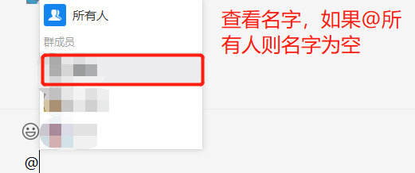
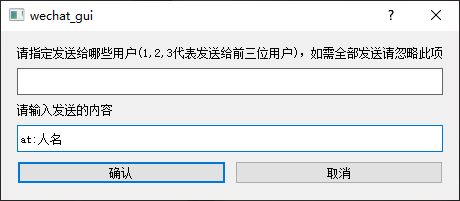

# easyChat

PC端微信助手（非web微信版）：定时发送信息；群发信息；自动回复等。直接下载文件目录内的exe即可使用。

最新编辑日期：2024/07/02

有疑问推荐在Issues上提出以供他人参考。

个人邮箱：[sujinltenjoy@gmail.com](mailto:sujinltenjoy@gmail.com)。

如果有帮到您的话，麻烦顺手点个star~

## 更新日志

<b></b>

#### 2024/07/02

- 增加了保存所有群聊名称的功能按钮。

#### 2024/06/28

- 优化了发送信息的逻辑，现在对同一用户发送信息只需要搜索用户一次即可全部发送。

#### 2024/05/08

- 修复了获取聊天记录时滚动条不显示时的逻辑bug，见 https://github.com/LTEnjoy/easyChat/pull/45 。感谢[@T-K-233](https://github.com/T-K-233)。

#### 2024/05/03

- 修改了防自动下线功能的间隔时间，现在每一小时触发一次,不会影响自动发送功能的正常使用。

#### 2024/04/29

- 增加了防止微信长时间挂机掉线的功能，要开启该功能直接点击“防止自动下线（目前关闭）”按钮。

#### 2024/04/16

- 目前定时功能支持自定义年月日，具体请看输入提示。

#### 2023/12/28

- 增加了对微信多种语言模式的支持（简体中文，繁体中文以及英文）。[@T-K-233](https://github.com/T-K-233)

#### 2023/11/21

- 完善了README.md文件。
- 调整了自动获取信息的代码，支持用户自定义自动回复的代码。 （参考 https://github.com/LTEnjoy/easyChat/issues/33 ）

#### 2023/11/17

- 修复了获取聊天记录代码的报错。

#### 2023/08/01

- 修复了无法at他人的bug。

#### 2023/07/24

- 现在程序在无法发送时会进行报错，不会直接闪退。
- 现在用户可以通过按下"ctrl + alt"来终止发送。

#### 2023/07/22  

- 现在代码调用方式支持存储聊天记录的图片和视频。

#### 2023/07/19  

- 对输入方式进行了优化。
- 现在支持加载内容txt文件。
- 现在一条信息可以指定用户发送而不是默认全部发送。

#### 2023/06/21  

- 现在ui界面支持读取微信联系人并存储成txt文件用于加载。

#### 2023/06/20  

- 修复了当好友数过少无法获取联系人的bug。

#### 2023/06/13

- 修复版本更新导致代码调用无法发送信息的bug。

#### 2022/11/22	

- 修正了文件版本更新混乱导致的出错问题。

#### 2022/11/03	

- 现在可以一次性添加多个人名，输入时通过英文逗号‘,’分隔即可。

#### 2022/09/26	

- 定时发送现在可以指定发送内容的范围（详情请使用最新版exe时看输入提示）。

#### 2022/09/16	

- 新增获取窗口聊天记录的功能（仅支持代码调用）。

#### 2022/07/27	

- 完成发送内容的优化，现在支持微信群@他人的操作

#### 2022/07/07	

- 完成发送内容的优化，现在支持一次定时按顺序发送多条信息。

## 前言

之前使用过的itchat等工具都是基于web版网页微信的。自从网页微信无法登陆之后，之前的工具都失效了。因此，本人采用[uiautomation](https://github.com/yinkaisheng/Python-UIAutomation-for-Windows)对微信进行~~暴力~~操作，就有了本仓库。并且用~~自学了三年的图形界面水平~~写了个简易ui供大家使用。

> 注意：请确保输入相应内容时严格按照示例的内容格式进行，以保证代码的正确执行。

## 支持功能

### 图形界面方式：

- 群发消息
- 定时发送消息
- 自动回复（参考 https://github.com/LTEnjoy/easyChat/issues/33 ）

> 注意事项：请在使用过程中严格遵守输入格式，否则程序会自动退出。（要去考虑一个个边界条件太麻烦了，我直接采取一个鸵鸟政策）。

### 代码调用方式：

- 在指定群聊中@他人（若@所有人需具备@所有人权限）-> def at()

- 搜索指定用户名的联系人发送信息 -> def send_msg()

- 搜索指定用户名的联系人发送文件 -> def send_file()

- 获取所有通讯录中所有联系人 -> def find_all_contacts()

- 自动检测新消息 -> def check_new_msg()

- 设置自动回复的联系人列表 -> def set_auto_reply()

- 获取指定聊天窗口的聊天记录 -> def get_dialogs()

- 获取指定聊天窗口的图片和视频 -> def save_dialog_pictures()

> 注意事项：请进入**ui_auto_wechat.py**文件内部进行调用。内部代码简易注释详尽，可以自由尝试。

## 文件说明

###### **automation.py**
可视化控件树的文件，针对希望DIY的用户，方便进行控件类型和深度的查看。

###### **clipboard.py**
提供了对文件的复制操作，调用函数即可将指定路径的文件复制到剪切板。

###### **ui_auto_wechat.py**
是对PC版微信进行的各种操作实现代码。内部代码简易，支持自由DIY。

###### **wechat_locale.py**
提供了对微信多种语言的支持，可以根据自己的需要进行选择。

###### **wechat_gui.py**
是编写的图形界面，在图形界面中调用对微信的操作。由于本人太懒，直接放弃美工，后期边做边改吧。

###### **module.py**

控件模块，组成UI界面的小组件。

###### **wechat_gui.exe**
是打包好的exe程序，可以直接下载进行使用。也可以对**wechat_gui.py**进行打包生成exe文件。

## 图形界面

			**图形界面示意图**

## 使用步骤

#### 基础操作

1. 点击“选择微信打开路径”，在目录下选择微信的可执行exe文件。

2. 点击“添加用户”，输入要发送信息的用户名（在搜索框第一个展示的名字，如下所示）。

   

3. 点击文本框右侧的添加按钮，选择添加文本或文件。添加的内容会在发送时按添加的顺序一次发送。

4. （可选）如果要进行定时发送，点击下方的“添加时间”按钮，按照规定的格式添加时间。随后点击“开始定时”，当时间达到列表中的指定时间时，便会将指定的消息发送给指定的用户。

#### 微信群@他人

1. 提前查看微信群里要@的人的名字

   

2. 在界面中添加文本内容，格式为“at: + 人名”（如果@所有人则不需要填写人名，注意冒号为英文符号）

   

> 注意：@所有人时请确保拥有微信群@所有人的权限，否则将失败。目前不支持直接在@人名后发送内容，请先@人名，随后单独添加发送内容。

#### 加载用户txt文件

用户可以提前查看所有要发送的对象的名字，并存储在一个txt文件中，之后点击”加载用户txt文件“按钮，即可自动加载所有对象。

用户txt文件格式如下：

每一行都是一个对象的名字。

#### 加载内容txt文件

你可以提前写下要发送的内容，并存储在一个txt文件中，之后点击”加载内容txt文件“按钮，即可自动加载所有内容。

> 注意事项：该方式仅支持发送文本内容

内容txt文件格式如下：

每一行都是一条内容消息。在输入内容之前，你需要先指定该条消息要发送给哪些对象：

- 如果默认发送给所有对象，则输入all:，然后写上要发送的内容
- 如果要发送给指定的对象，则输入用户的编号，多个用户之间用英文逗号分隔（如1,2,3），然后写上要发送的内容

> 注意事项：指定对象与发送内容之间要用英文冒号进行分隔

## 友情赞助

如果你觉得这款应用不错的话，麻烦顺手点个star。也可以请作者喝杯奶茶，让我在日常生活中感受到一些小确幸~

